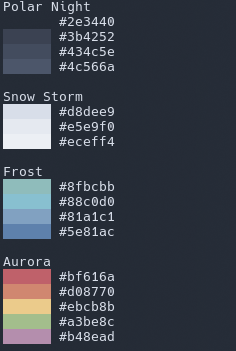

# nord-cli

A small Bash utility to display the [Nord](https://www.nordtheme.com/) color palette in the terminal or return individual hex values by color name.

## Features

- Print the full Nord palette
- Show colored preview blocks in the terminal
- Look up single colors by name

## Example



## Requirements

- Bash
- A terminal with true color support

## Installation

```bash
git clone https://github.com/Kraftfabrik/nord-cli.git
cd nord-cli
cp nord-cli ~/.local/bin/
```
Make sure `~/.local/bin` is in your `PATH`.

## Usage

Print the full palette:

```bash
nord-cli
```

Look up a single color:

```bash
nord-cli green
nord-cli red
nord-cli dark_gray
nord-cli bright_white
nord-cli white
...
```

